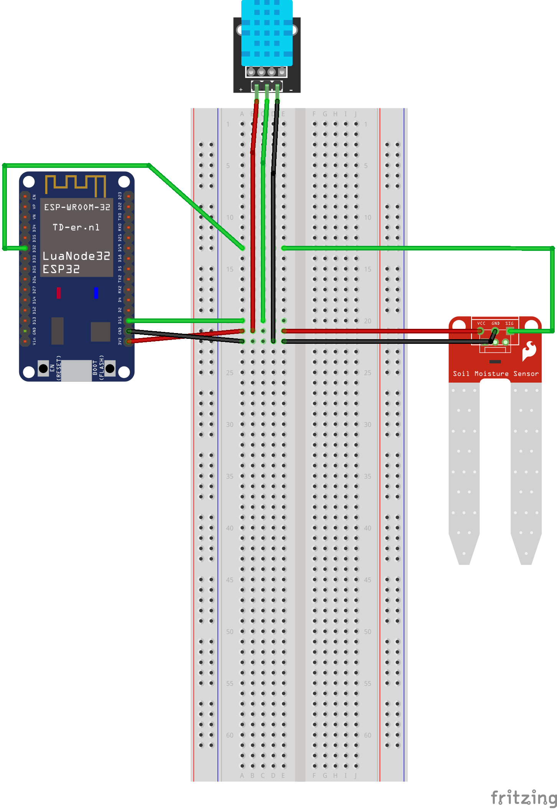

# ESP32-WROOM-32 + DHT11 + FC-28 Proof of Concept

## 개요

이 프로젝트는 **ESP32-WROOM-32**와 **DHT11 온습도 센서**,**FC-28 토양 습윤 센서**를 활용하여 실내 온습도와 토양 습윤도를 측정하고, 이를 시리얼로 출력하거나 **MQTT 브로커**로 송신하는 과정을 다룹니다. 이를 통해 토양 습윤 데이터를 수집하고 IoT 기능을 구현합니다.


## 회로 구성

### 연결 정보

| DHT-11 핀 | ESP32 핀 | 설명                 |
|----------|----------|----------------------|
| + (VCC)  | 3.3V     | ESP32의 3.3V 핀 연결  |
| - (GND)  | GND      | ESP32의 GND 핀 연결   |
| OUT      | GPIO 15  | ESP32의 디지털 핀     |


| FC-28 핀 | ESP32 핀 | 설명                  |
|----------|----------|-----------------------|
| VCC      | 3.3V     | ESP32의 3.3V 핀 연결 |
| GND      | GND      | ESP32의 GND 핀 연결  |
| AO       | GPIO 32  | ESP32의 아날로그 핀  |




## 환경 설정

### Wi-Fi 설정

Wi-Fi 정보는 프로젝트의 `include/key.h` 파일에서 설정합니다.

```cpp
// WiFi 설정
inline constexpr const char* ssid = "<Wi-Fi 네트워크 이름>";
inline constexpr const char* password = "<Wi-Fi 비밀번호>";
// MQTT 설정
inline constexpr const char* mqtt_server = "<MQTT 브로커서버 URL>";
inline constexpr const char* mqtt_topic_input = "<MQTT 브로커서버 input 토픽>";
inline constexpr const char* mqtt_topic_output = "<MQTT 브로커서버 output 토픽>";
```


## 학습 포인트

1. **DHT11 + FC-28 센서 다루기** 
    센서 결선 및 데이터 수집을 위한 코드 작성, 

2. **IoT 통신:**  
    MQTT 프로토콜을 사용하여 수집된 데이터를 브로커로 송신. JSON 데이터 형식을 통해 값 전송

3. **라이브러리 함수 선언**
    include 경로 내 헤더파일(*.h) 함수 선언 구현파일(*.cpp) 나눠 정의 후 main.cpp 에 깔끔하게 정리
